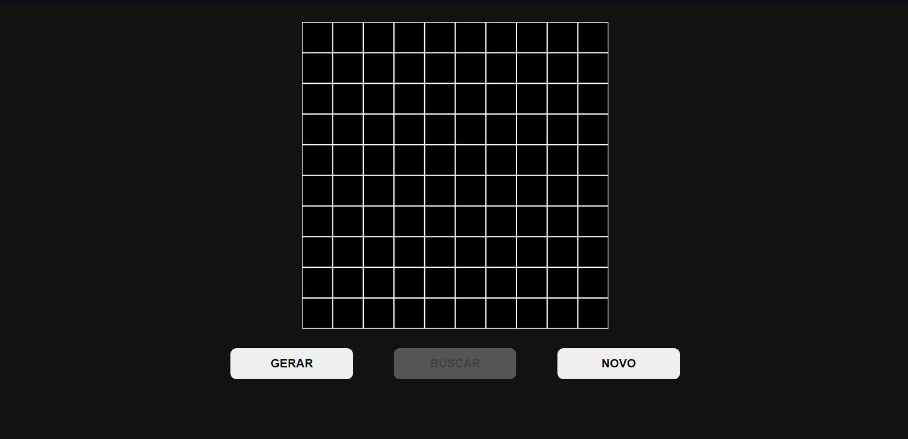
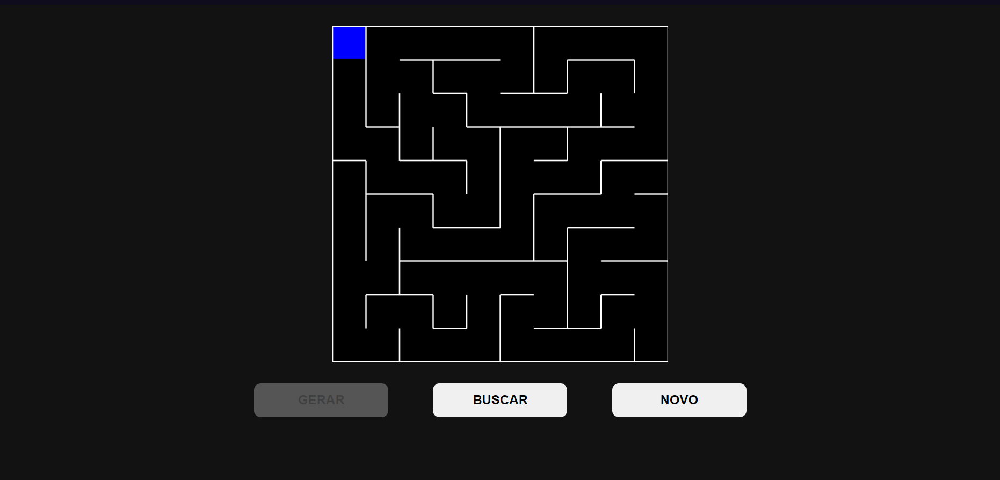
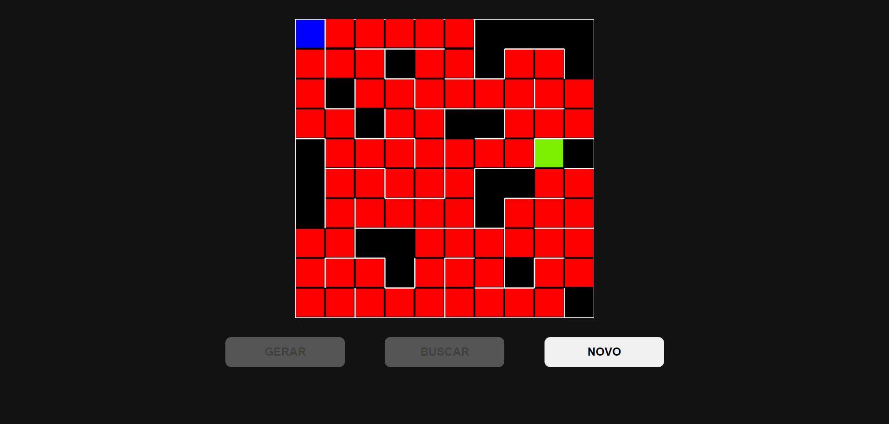

Temas:
 - Grafos1
 

# O Labirinto do Fauno

**Conteúdo da Disciplina**: Grafos 1 

## Alunos
|Matrícula | Aluno |
| -- | -- |
| 170032591  |  Edvan Barreira Gomes Junior |
| 170020525  |  Pedro Henrique de Lima Malaquias |

## Sobre 

 Projeto com objetivo de gerar um labirinto seguindo a ideia do algoritomo de labirinto com a aplicação do DFS(
Depth First Search). Depois do labirinto ser gerado é feita uma busca utilizando a Busca em largura (Breadth-first search) para encontrar o melhor caminho até um certo ponto dentro do labirinto.
 

## Screenshots

## Instalação 
**Linguagem**: JavaScript 
* Internet
* Vscode
* VScode com o plugin Live Server

## Uso 
Executar o arquivo index.html em algum navegador.

